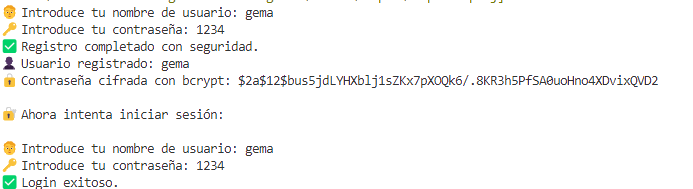
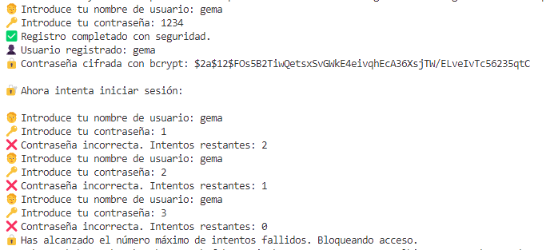

## 🔐 **Etapa 2: Realizar login** ##  
📌 Descripción  
En esta etapa, **modificamos el login** para que el usuario pueda autenticarse de manera segura, mejorando la protección contra ataques.    
🔹 Se usa `bcrypt` en lugar de SHA-256 para proteger las contraseñas.    
🔹 Se limita el número de intentos fallidos para evitar ataques de fuerza bruta.    

## 🚀 **Mejoras respecto a Etapa 1**  
✅ **Cambio de SHA-256 a `bcrypt`** → Aumento significativo en seguridad.    
✅ **Salt automático y múltiples rondas** → `bcrypt` genera un salt único y aplica iteraciones.   
✅ **Verificación más eficiente** → `BCrypt.Verify()` compara la contraseña cifrada con la ingresada.   
✅ **Protección contra fuerza bruta** → Se limita el login a **3 intentos fallidos** antes de bloquear el acceso.  
✅ **Mensaje de bloqueo** → Se informa al usuario cuando alcanza el máximo de intentos.   

## 🎯 Salida esperada del sistema de registro:  
  
  

📌 Explica el mecanismo de Login utilizado (máximo 5 líneas).    
El usuario introduce su nombre y contraseña en texto plano. La contraseña se cifra utilizando bcrypt, que genera un salt aleatorio y aplica múltiples rondas de hash para reforzar la seguridad. Luego, el sistema almacena el nombre de usuario y el hash de la contraseña, sin guardar información en texto plano. Durante el login, la contraseña ingresada se compara con el hash almacenado mediante BCrypt.Verify(), permitiendo el acceso solo si coinciden. Además, se limita el número de intentos fallidos a 3 para prevenir ataques de fuerza bruta.
