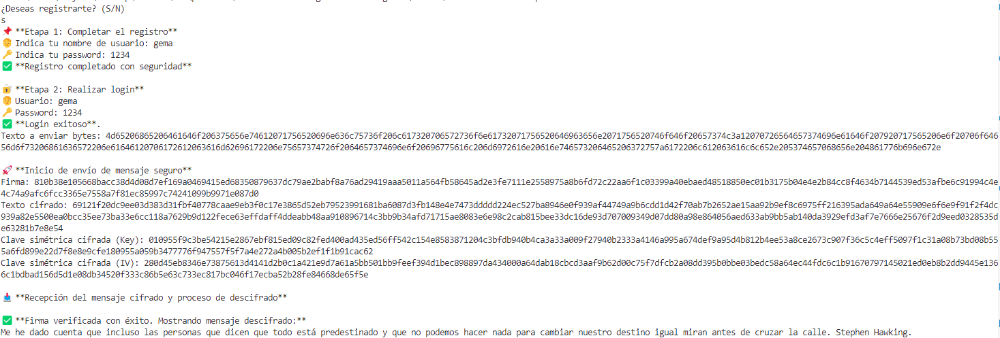

##🔐 **Parte 2. Simulación de Envío y Recepción Segura**##    
⚙️ Etapas del Programa    
✅ Lado Emisor    
1️⃣ Firmar mensaje: Se firma el mensaje original con criptografía asimétrica utilizando la clave privada del emisor.   
2️⃣ Cifrar mensaje: El emisor cifra el mensaje con una clave simétrica generada en ese momento.   
3️⃣ Cifrar clave simétrica: Se cifra la clave simétrica con la clave pública del receptor para garantizar que solo el receptor pueda descifrarla.  
📤 Datos enviados al receptor:  
Firma digital del mensaje.  
Mensaje cifrado.  
Clave simétrica cifrada (Key y IV).    

✅ Lado Receptor  
4️⃣ Descifrar clave simétrica: Se usa la clave privada del receptor para descifrar la clave simétrica enviada por el emisor.   
5️⃣ Descifrar mensaje: Con la clave simétrica descifrada, el receptor recupera el mensaje original.   
6️⃣ Comprobación de firma: Se verifica que la firma del mensaje sea válida para garantizar que el mensaje no ha sido modificado.  

🔒 Seguridad y Técnicas Implementadas  
✅ Criptografía simétrica: Se usa para cifrar el mensaje de manera eficiente.   
✅ Criptografía asimétrica (RSA): Se utiliza para firmar mensajes y cifrar la clave simétrica.   
✅ Firma digital: Permite validar la autenticidad e integridad del mensaje recibido.   
✅ Gestión correcta de claves: Se garantiza que el emisor y receptor utilicen las claves adecuadas en cada fase del proceso.  

##🎯 Salida esperada del sistema de envío y recepción:  
  

**Realiza una pequeña explicación de cada uno de los pasos que has hecho especificando el procedimiento que empleas en cada uno de ellos.**    
En el lado del emisor    
Se firma el mensaje:   
-Se convierte el mensaje en un formato de bytes para que pueda ser procesado criptográficamente.  
-Se utiliza la clave privada del Emisor para generar una firma digital del mensaje.    
-Esta firma asegura que el mensaje proviene del Emisor y no ha sido modificado en el proceso de envío.  
Se cifra el mensaje:    
-Se usa una clave simétrica (AES) para cifrar el mensaje.  
-AES es más eficiente para cifrar grandes volúmenes de datos que RSA, por lo que se usa para proteger el contenido del mensaje.  
-Se obtiene un mensaje cifrado que solo puede ser descifrado con la clave simétrica correcta.  
Se cifra la clave simétrica:  
-Se cifra la clave simétrica con la clave pública del Receptor, asegurando que solo el Receptor pueda descifrarla con su clave privada.  
-Tanto la clave como el vector de inicialización (IV) se cifran por separado.  
-Este paso impide que cualquier otra persona acceda a la clave y descifre el mensaje.  
Los datos que se envian al receptor son la firma digital, el mensaje cifrado y la clave simétrica cifrada  
En el lado del receptor  
Se descifra la clave simétrica:    
-Se usa la clave privada del Receptor para descifrar la clave simétrica enviada por el Emisor.    
-Sin esta clave, el mensaje cifrado no podría ser interpretado correctamente.  
Se descifra el mensaje:  
-Con la clave simétrica descifrada, el receptor procede a descifrar el mensaje original.  
-Se recupera el texto plano que había sido cifrado en el lado del Emisor.  
Se verifica la firma:  
-Se verifica la firma del mensaje comparándola con el mensaje descifrado  
-Si la firma es válida, el receptor sabe que el mensaje proviene del Emisor y que no ha sido alterado.  
-Si la firma no es válida, se muestra un error indicando que el mensaje podría haber sido modificado.  
Conclusión:  
-Integridad: La firma asegura que el mensaje no ha sido alterado.  
-Confidencialidad: El cifrado simétrico y asimétrico garantiza que solo el receptor pueda descifrar el mensaje  
-Autenticación: La firma digital confirma que el mensaje realmente proviene del Emisor.  

**Pregunta:**  
**Una vez realizada la práctica, ¿crees que alguno de los métodos programado en la clase asimétrica se podría eliminar por carecer de una utilidad real?**  
Sí, al revisar la clase ClaveAsimetrica, considero que hay al menos un método que podría eliminarse por no tener una utilidad real en un entorno seguro y funcional. En concreto:  
public byte[] DescifrarMensaje (byte[] MensajeCifradoBytes, RSAParameters ClavePublicaExterna)  
Este método intenta descifrar un mensaje usando una clave pública externa, lo cual no tiene sentido desde el punto de vista criptográfico. En la criptografía   asimétrica, el cifrado se realiza con la clave pública del receptor y el descifrado únicamente con su clave privada, que no debe compartirse. La clave pública no puede descifrar mensajes cifrados con ella misma, por lo que este método simplemente no debería existir.  
Además, otro método que podría considerarse redundante es:  
public byte[] FirmarMensaje (byte[] MensajeBytes, RSAParameters ClavePublicaExterna)  
Firmar con una clave pública tampoco tiene sentido, ya que la firma digital debe generarse con la clave privada del emisor, y luego verificarse con la clave pública.   

